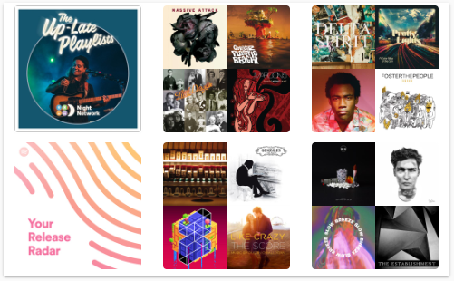

# Spotify Playlist Card


This is a Home Assistant Lovelace card that takes your Spotify playlists and creates buttons that will start the playlist when pressed. Requires the [Spotify Playlist sensor](https://github.com/dnguyen800/Spotify-Playlist-Sensor) and the [Spotify Media Player](https://www.home-assistant.io/components/media_player.spotify/) to be setup.

Note: There is another Spotify Playlist card by user @fondberg [here](https://github.com/fondberg/spotify-card) that is much cleaner and less hacky than my card. Doesn't require the Feed Parser sensor either. Check it out! I don't plan to make much updates on this card, besides fixing a few bugs.

## Features
  - Press/click on the image to start the playlist on the selected Spotify media player.
  - specify number of columns, image size
  
## Options

| Name | Type | Default | Description
| ---- | ---- | ------- | -----------
| media_player | string | **Required** | Name of the Spotify media player in your Home Assistant instance. For example, `media_player.spotify`
| entity| string | **Required** | Name of the Spotify Playlist sensor that holds your playlist info. For example, `sensor.playlists`
| columns | int | '3' | Number of columns to display. Default is 3
| size | string | '140px' | Size of playlist image. Can be listed as pixel (50px) or percentage (50%).
| show_name | boolean | 'false' | Show playlist names. 
| show_title | boolean | 'false' | Shows the card title. 
| title | string | 'Playlists' | Card title.

## Instructions
1. Install the [Spotify Playlist sensor](https://github.com/dnguyen800/Spotify-Playlist-Sensor) and confirm your playlists and their URI and image URLs are loaded in the sensor.
1. Download the [spotify-playlist-card](https://raw.githubusercontent.com/dnguyen800/Spotify-Playlist/master/spotify-playlist-card.js)
2. Place the file in your `config/www` folder
3. Include the card code in your `ui-lovelace-card.yaml`
```yaml
resources:
  - url: /local/spotify-playlist-card.js
    type: js
```
4. Write configuration for the card in your `ui-lovelace.yaml` and add your sensor and Spotify media player.

```yaml
  - type: "custom:spotify-playlist"
    entity: sensor.playlists
    media_player: media_player.spotify
    columns: 3
    size: '140px'       
    show_name: false      
    show_title: false
    title: 'My Playlists'   
```

## FAQ
 - This card doesn't work in Fully Kiosk Browser on Amazon Fire tablets. Why?

   This card uses a new CSS function, CSS Grid Layout, which was implemented in October 2018, and isn't compatible with browsers using old versions of Android WebView. That's my guess anyways.

 - I press on a playlist button but I don't hear the playlist playing.
 
 If Spotify has been inactive for some time, Spotify will not start playing on the last played device. Start playing Spotify on any device, then try pressing the playlist button again.
 
## Support
I am studying Python as a hobby and this is my first public project. Unfortunately, I know nothing about Javascript and relied on studying other Lovelace custom cards to write this. Suggestions are welcome but no promises if I can fix anything! If you're familiar with CSS, then you can edit the CSS style in the .js file directly!

## Credits
  - [Tracker-card](https://github.com/custom-cards/tracker-card) which I studied and re-used the button code.

